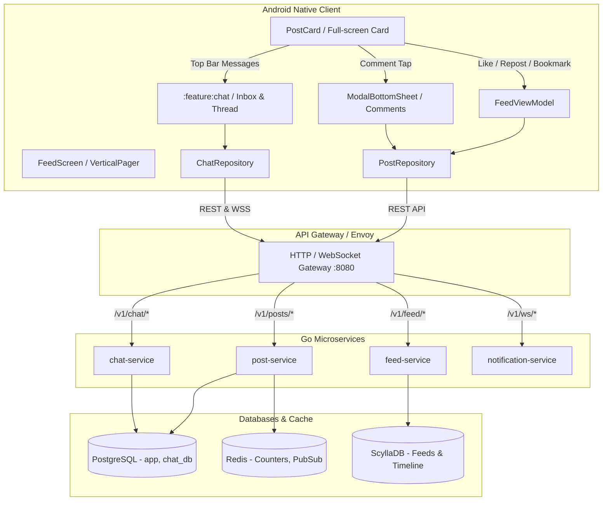

# Social Graph & Engagement Engine — Architecture & Implementation Guide

> **Document Version:** 1.0.0  
> **Status:** Analysis & Implementation Blueprint  
> **Target Platforms:** Native Android (Jetpack Compose), Go Backend Microservices (`post-service`, `feed-service`, `chat-service`, `notification-service`)

---

## 1. Executive Summary

This document provides an end-to-end technical analysis and implementation roadmap for the **Social Graph & Engagement Engine**. It analyzes the gap between the current feed prototype and a production-grade, immersive social platform (matching Instagram, TikTok, and modern Twitter/X behavior), covering:

1. **Direct Messaging / Chat System** (`:feature:chat`, WebSockets, Real-time Inbox)
2. **Interactive Comments Experience** (Sliding Modal Bottom Sheet, Real-time Posting, Emoji Picker)
3. **Likes & Multi-Reactions** (Optimistic UI, Persistent Database Storage, Live Counts)
4. **Reposts & Quotes** (One-Tap Repost, Quote Creation, Feed Fan-Out)
5. **In-App & External Sharing** (Native Share Sheet, Direct Send to Followers, Share Metric Logging)
6. **View Count & Impression Engine** (Dwell-Time Impression Beacons, Scalable Counter Sharding)

---

## 2. System Architecture & Component Mapping

---

## 3. Deep-Dive Feature Analysis

### 3.1. Chat & Direct Messaging
* **Problem**: In `FeedScreen.kt`, the top-bar message icon is an inert button (`IconButton(onClick = {})`), and the Android client lacks a `:feature:chat` module.
* **Backend Status**: Backend schema `chat_db` and real-time notification WebSockets exist.
* **Target Experience**:
  * Top bar message badge with unread count pill.
  * Tapping opens `ChatInboxScreen` listing active conversations with user avatars, last message snippet, and timestamp.
  * Tapping a thread opens `ChatThreadScreen` with message bubbles, image attachments, read receipts, and real-time typing indicators.

---

### 3.2. Interactive Comments Modal Sheet
* **Problem**: Tapping comment currently navigates to `CommentsScreen.kt`, which only renders a read-only list with no composer or text input.
* **Target Experience**:
  * Tapping the comment icon opens a sliding **`ModalBottomSheet`** over the currently playing video/post.
  * Sheet header displays total comment count (e.g. `124 comments`).
  * Smooth `LazyColumn` of comments with user avatars, relative timestamps, and per-comment like hearts.
  * Sticky bottom composer row: User avatar + rounded text input (`"Add a comment..."`) + quick emoji reaction bar (`❤️ 🔥 🙌 😂 👏`) + **Post** button.
  * Optimistic UI: Appending the new comment locally and incrementing the post card's comment count immediately.

---

### 3.3. Likes & Reactions Persistence
* **Problem**: `FeedViewModel.kt` only updates in-memory state (`_pendingActions`). No HTTP network call is made to persist the like to PostgreSQL.
* **Target Experience**:
  * Tapping the Heart icon triggers a double action:
    1. **Immediate Optimistic UI**: Glow / scale animation on heart icon + instant `+1` / `-1` count flip.
    2. **Background Sync**: Dispatches `postRepository.addReaction(postId, "like")` or `removeReaction(postId)`.
    3. **Rollback Safety**: Reverts the local toggle only if the network request fails with a snackbar warning.

---

### 3.4. Reposts & Sharing
* **Problem**:
  * Repost button currently has no action handler in `FeedScreen.kt`, and the backend route `POST /v1/posts/:postId/repost` is unregistered in `handler.go`.
  * Share button invokes native system share dialog (`Intent.ACTION_SEND`), but does not log analytics or offer in-app direct share.
* **Target Experience**:
  * **One-Tap Repost**: Instant confirmation dialog or one-tap repost with haptic feedback, calling `POST /v1/posts/:postId/repost` and fanning out to followers' feeds.
  * **In-App Share Sheet**: Bottom sheet with:
    - Quick-send avatars to top 5 recent chat contacts.
    - "Add Post to Story".
    - "Copy Link" (copies clean post URL to clipboard).
    - "Share via..." (triggers native system share).
    - Dispatches `POST /v1/posts/:postId/share` to increment share analytics.

---

### 3.5. View Count & Impression Engine
* **Problem**: `view_count` is returned by the API but omitted from `PostCard.kt`. There is no impression tracking when a user dwells on a card.
* **Target Experience**:
  * **UI Display**: Subtle view count indicator (e.g. `👁️ 1.2K` or chart glyph) displayed in the bottom creator row or action bar.
  * **Dwell Impression Tracker**: When `pagerState.settledPage` stays on an item for $\ge 1.0\text{s}$, emit a debounced event to `POST /v1/posts/:postId/view` or batch flush views on scroll idle.

---

## 4. API Specification & Contract Table

| Endpoint | Method | Purpose | Payload / Parameters |
| :--- | :---: | :--- | :--- |
| `/v1/posts/{id}/reactions` | `POST` | Add like / reaction | `{"reaction": "like"}` |
| `/v1/posts/{id}/reactions` | `DELETE` | Remove like / reaction | _None (viewer derived from JWT)_ |
| `/v1/posts/{id}/comments` | `GET` | Fetch comments page | `?limit=50&cursor=...` |
| `/v1/posts/{id}/comments` | `POST` | Add comment | `{"body": "Awesome shot! 🔥"}` |
| `/v1/posts/{id}/repost` | `POST` | Repost to timeline | `{"repost_type": "plain"}` |
| `/v1/posts/{id}/repost` | `DELETE` | Undo repost | _None_ |
| `/v1/posts/{id}/share` | `POST` | Increment share count | `{"platform": "direct_message" \| "external"}` |
| `/v1/posts/{id}/view` | `POST` | Record view impression | `{"dwell_time_ms": 3200}` |
| `/v1/chat/conversations` | `GET` | List chat threads | `?limit=20` |
| `/v1/chat/messages/{id}` | `POST` | Send chat message | `{"recipient_id": "...", "text": "Hi"}` |

---

## 5. Implementation Checklist

### Phase 1: Likes, Reposts & Comments Backend Connection
- [ ] **`post-service`**: Register `POST` & `DELETE` `/v1/posts/:postId/repost` in `internal/http/handler.go`.
- [ ] **`PostApi.kt`**: Add `POST /v1/posts/{postId}/comments` and `POST /v1/posts/{postId}/share`.
- [ ] **`FeedViewModel.kt`**: Connect `onLocalReaction`, `onLocalBookmark`, and `onLocalRepost` to `PostRepository` network calls.

### Phase 2: Comments Bottom Sheet & Composer
- [ ] Create `CommentBottomSheet.kt` with `ModalBottomSheet`, `CommentInputBar`, and emoji pills.
- [ ] Update `FeedScreen.kt` to open `CommentBottomSheet` on comment button tap.
- [ ] Support real-time optimistic comment insertion.

### Phase 3: In-App Share Sheet & View Impressions
- [ ] Create `PostShareSheet.kt` with quick DM send, Copy Link, and system share.
- [ ] Add `viewCount` display to `PostCardState` and `PostCard.kt`.
- [ ] Add impression tracking in `FeedScreen.kt` via `LaunchedEffect(pagerState.settledPage)`.

### Phase 4: Direct Messaging Module (`:feature:chat`)
- [ ] Create `mobile/android/feature/chat` module.
- [ ] Implement `ConversationListScreen.kt` and `ChatRoomScreen.kt`.
- [ ] Wire top-bar message icon in `FeedScreen.kt` to navigate to the inbox.
